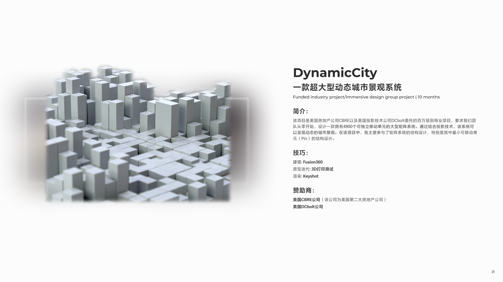
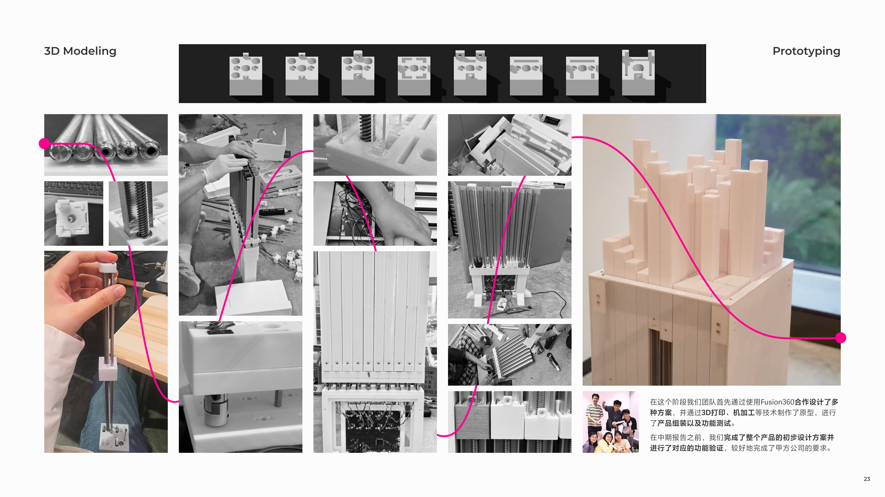
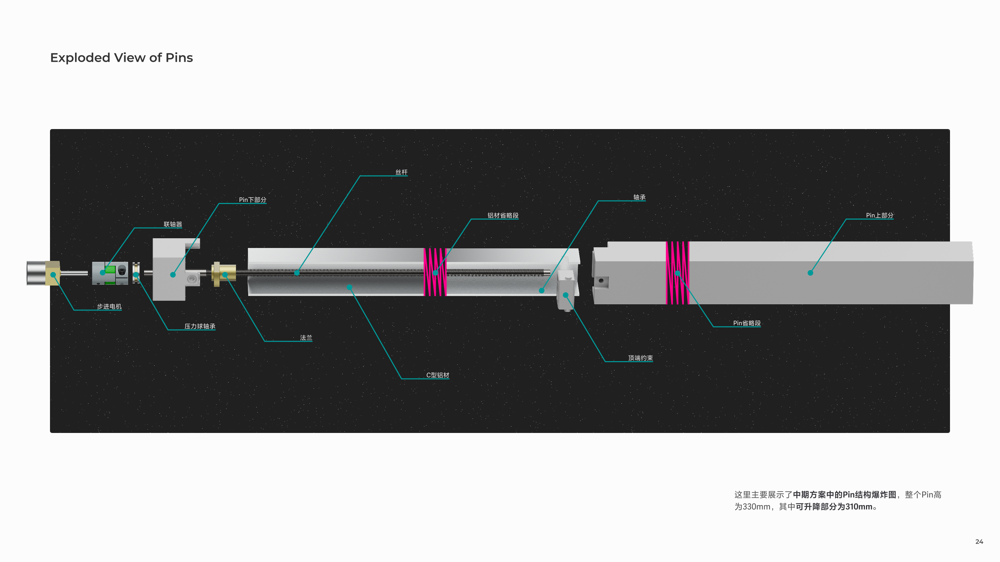
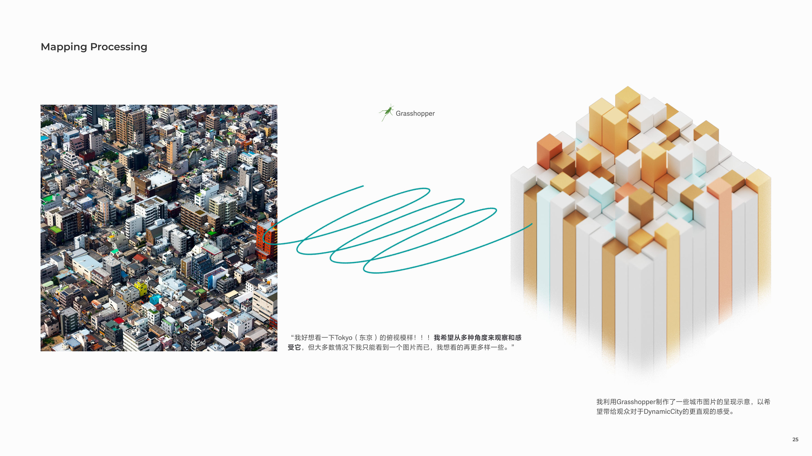
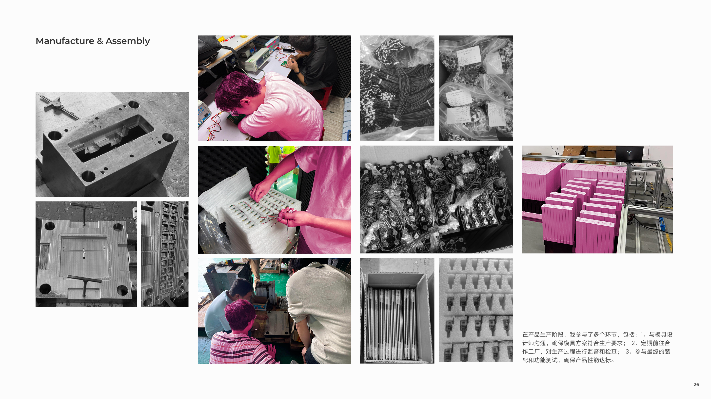
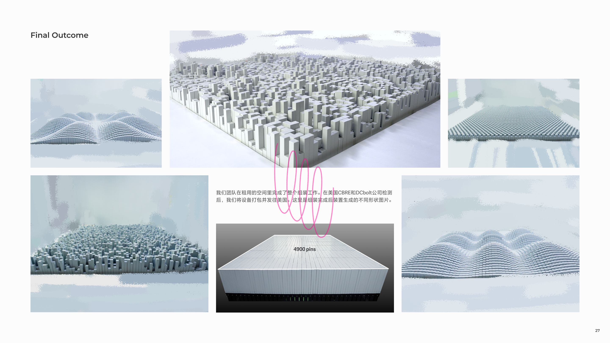

Hello everyone, I'd like to introduce the DynamicCity project. This project is **a company-supported project.** American companies, CBRE/DCbolt, collaborated with our group, the Immersive Design Group in the School of Design at SUSTech. I mainly focus on **structure and CMF design** in this project.

The installation has been successfully installed and is currently on display at CBRE.

## Background

<small class="block text-center">In fact, dynamic array matrices have received widespread attention in the scientific research field. Before we started the design project, we conducted a comprehensive data collection to understand the existing technical details.</small>

## Prototpying

<small class="block text-center">Our team conducted many versions of design testing, and here I show you the design work that I was mainly responsible for.</small>

## Ideas

<small class="block text-center">Here I present the vision for our device: we hope to dynamically present the 3D cityscapes that users desire.</small>

## Manufacturing

<small class="block text-center">Our team contacted mold manufacturers and injection molding suppliers, as well as raw material suppliers. Here are some pictures of our company visits and cooperation process.</small>

## Finally

<small class="block text-center">This shows our final device, along with a schematic diagram of some of the shapes it can generate.</small>

