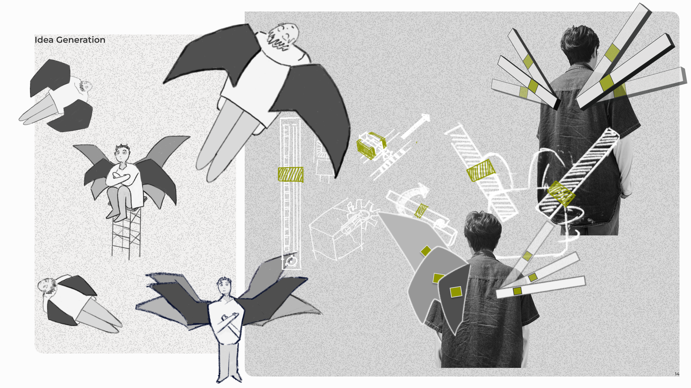
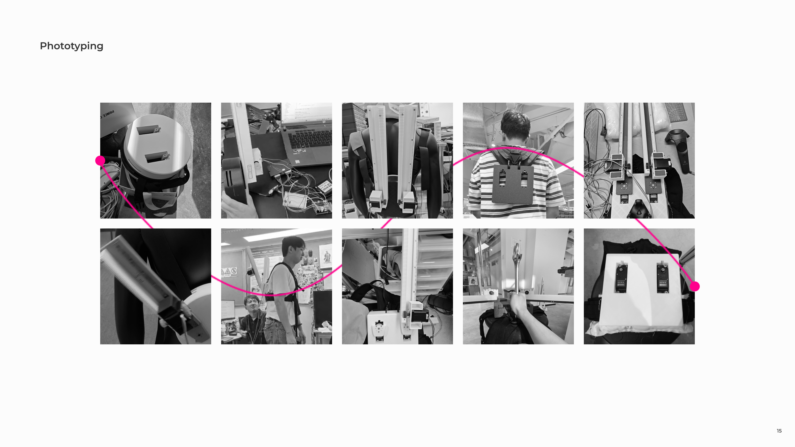
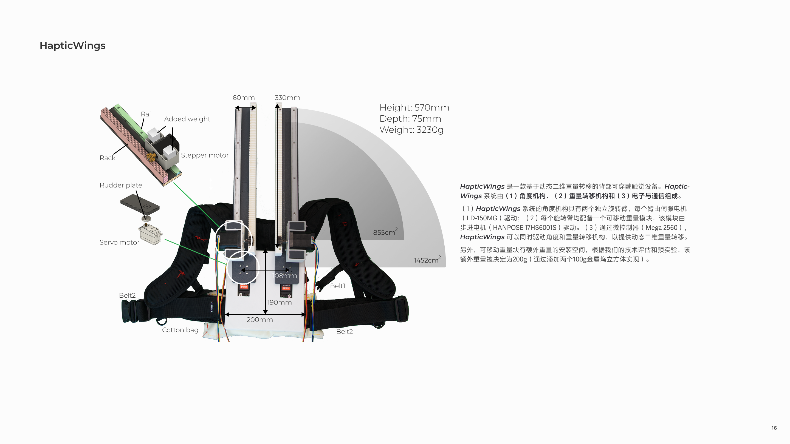
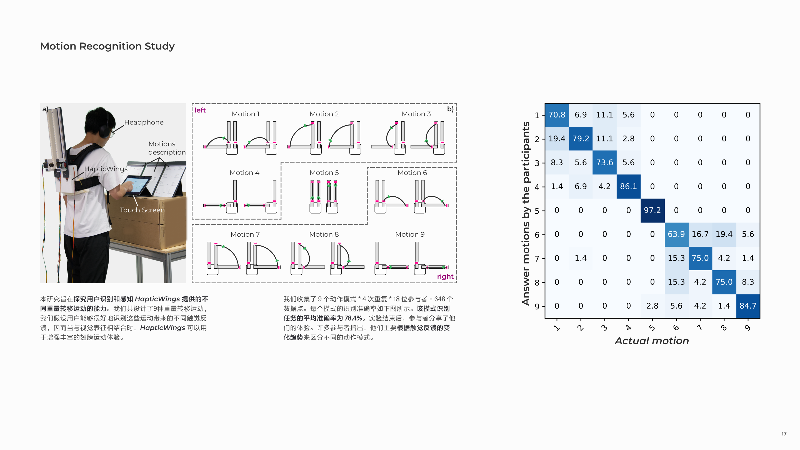
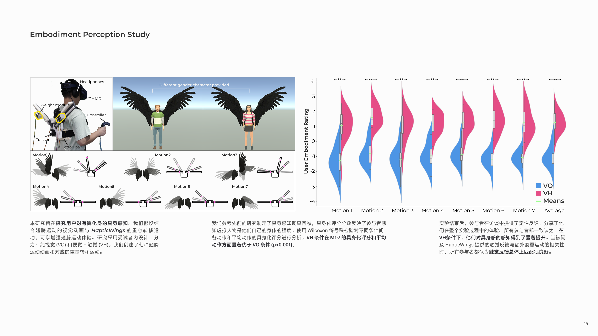
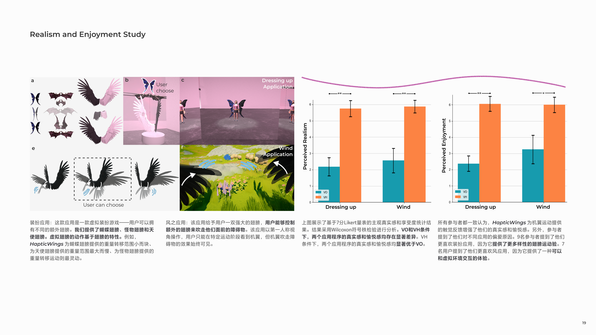

Hello everyone, I'd like to introduce the HapticWings project. Briefly, we created a back-worn haptic device that utilizes dynamic 2D weight shifting to provide haptic feedback. Through the combination of visual feedback on wing movements and haptic feedback from weight shifting, the user experiences enhanced wing motions. Using three user studies, we proved our ideas. The final result has been published in the 2025 **ACM Designing Interactive Systems Conference** and received the **Best Paper Award.** You could find it here. [HapticWings: Enhancing the Experience of Extra Wing Motions in Virtual Reality through Dynamic 2D Weight Shifting](https://dl.acm.org/doi/10.1145/3715336.3735755)

## Research

<small class="block text-center">Since ancient times, humans have desired to change and extend their bodies, which related works can be found in many cultural and modern works, for example, owing wings (e.g., Icarus from Greek mythology, and Falcon from Marvel Comics), etc.</small>

<small class="block text-center">Thanks to the development of Virtual Reality (VR) technology, we can overcome our limitations by transforming real bodies into virtual avatars that could feature different bodies in VR.</small>

## Design

<small class="block text-center">Here I show part of my sketches, and during the design process, we positively used 3D printing for real testing.</small>

## Prototyping

<small class="block text-center">HapticWings is a back-worn haptic device based on dynamic 2D weight shifting. The upon figure illustrates its design.</small>

## Studies

<small class="block text-center">We conducted the study 1 to examine how users recognize and perceive various weight-shifting motions provided by HapticWings.</small>

<small class="block text-center">We conducted the study 2 to explore the user’s embodiment when using HapticWings to provide haptic feedback for the wings’ motions.</small>

<small class="block text-center">We conducted the study 3 to explore the user-perceived level of realism and enjoyment using HapticWings.</small>

## Future

<small class="block text-center">This is our vision for the future form of HapticWings.</small>

