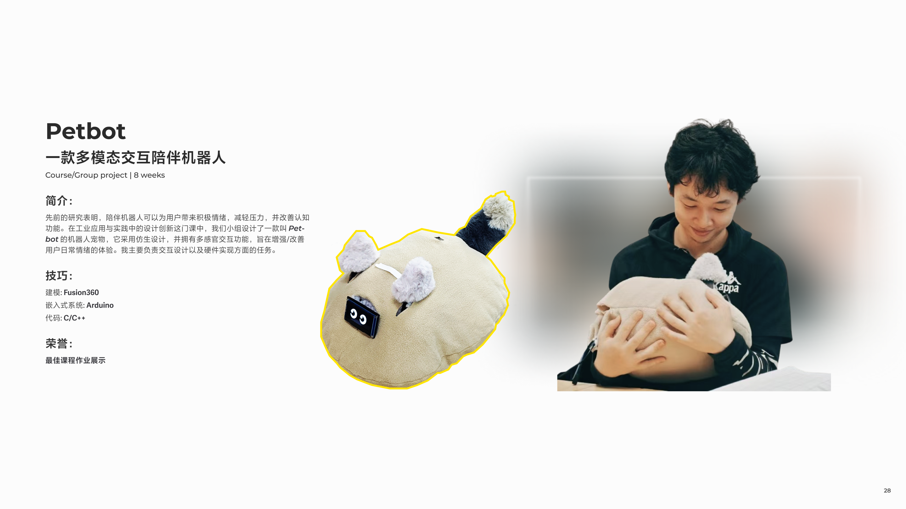
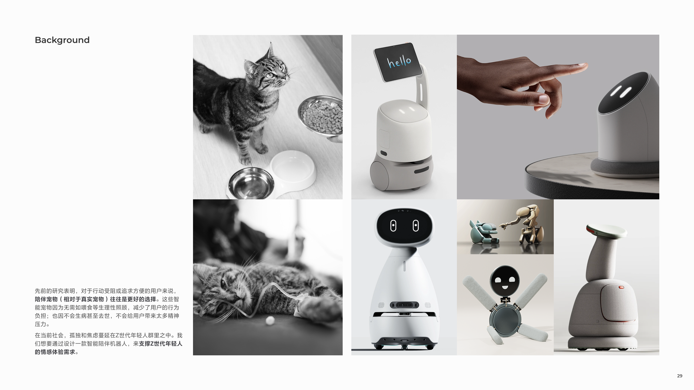
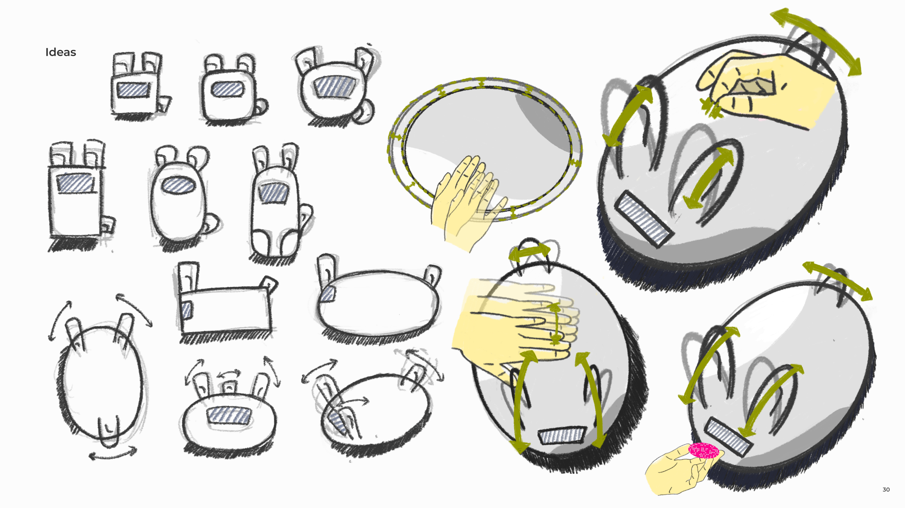
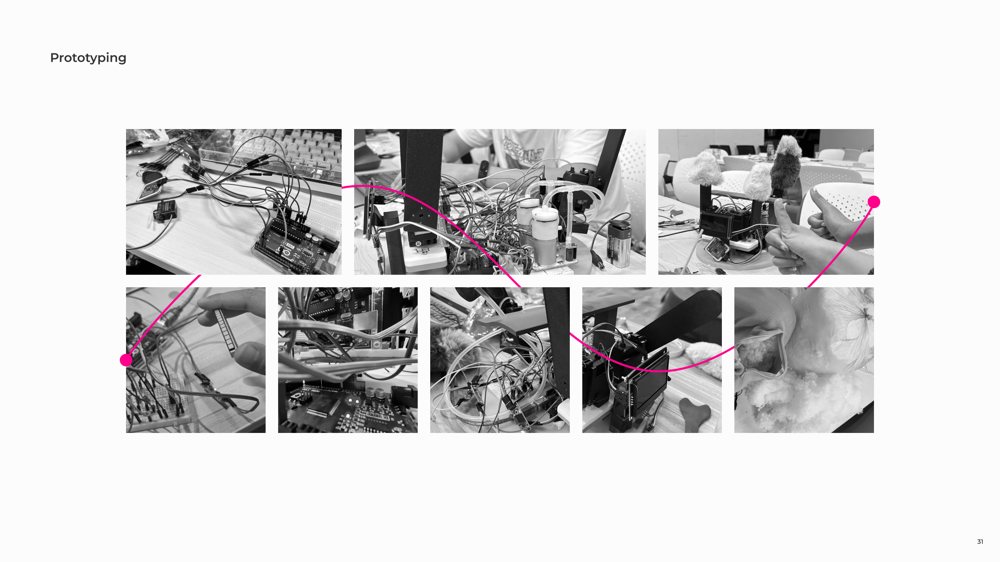
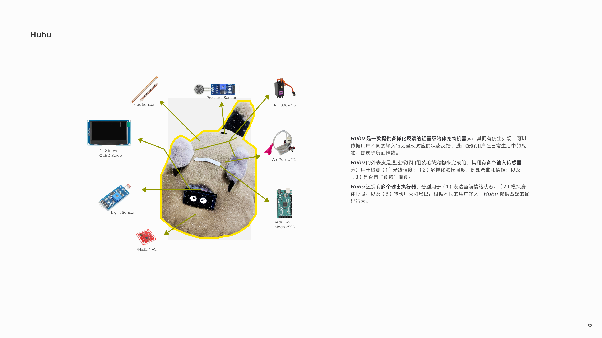
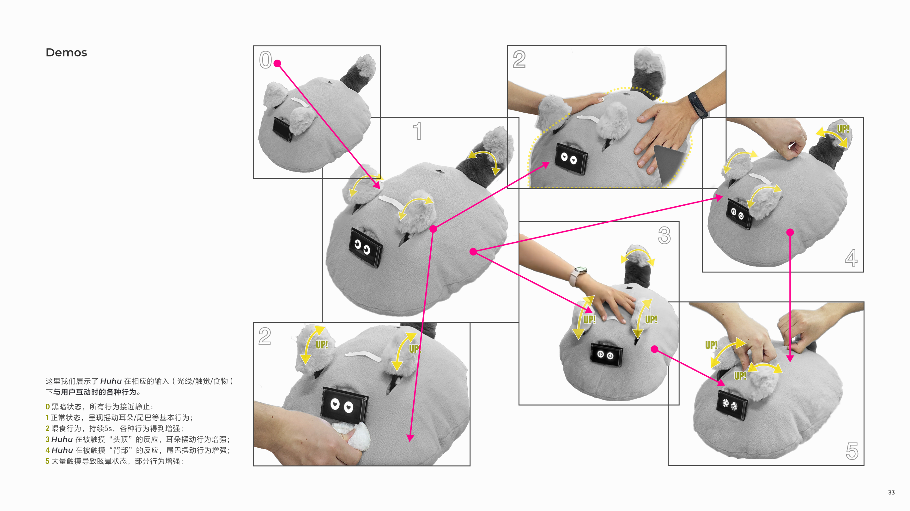

Hello everyone, I'd like to introduce the Petbot project. This was a group collaborative course project. Our team designed a biomimetic robot with multi-sensory interaction capabilities, aiming to enhance/improve the daily emotional experience of university students. In this project, I was primarily responsible for the **structural design and code writing.**

This project ultimately received an **Outstanding Coursework Award.**

## Background

<small class="block text-center">Pets can provide emotional support, but they often face the natural cycle of birth, aging, illness, and death, which inevitably saddens their owners. We aim to design an intelligent companion pet robot to provide daily emotional support for anxious Generation Z university students.</small>

## Ideas

<small class="block text-center">Part of sketches.</small>

## Design

<small class="block text-center">We used many sensors and actuators to simulate various behaviors of real pets.</small>

## Demos

<small class="block text-center">There are the different states of Petbot and how it switches among them.</small>

